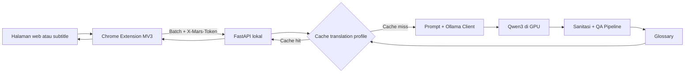

# Mars Web Translator AI


Penerjemah dokumentasi web lokal berbasis Chrome Extension, FastAPI, Ollama, dan model Qwen3. Teks halaman diproses di komputer sendiri; kode, URL, command, nama API, dan istilah teknis dipertahankan.

Project ini dibuat sebagai penerjemah lokal untuk dokumentasi software dan AI. Isi halaman tidak perlu dikirim ke layanan penerjemahan cloud karena inferensi dilakukan oleh Ollama di komputer pengguna.

> [!IMPORTANT]
> Versi saat ini adalah **v0.3.0-dev.1**. Project masih dalam tahap pengembangan dan mewajibkan model aktif berjalan di GPU; fallback CPU sengaja tidak disediakan.

## Komponen utama

- Chrome/Brave Extension Manifest V3 untuk teks halaman dan subtitle.
- FastAPI di `127.0.0.1:8000`.
- Ollama dengan model resmi `mars-translator-qwen3:latest`, berbasis `qwen3:8b`.
- Cache browser V2 dan cache SQLite backend V2 yang terikat pada model, prompt, glossary, dan parameter inferensi.
- Token bersama `X-Mars-Token`, validasi Origin, dan GPU wajib.

## Fitur utama

- Menerjemahkan teks halaman dari Bahasa Inggris ke Bahasa Indonesia.
- Menjelaskan teks teknis dengan mode `explain`.
- Memprioritaskan teks yang terlihat di viewport dan melanjutkan halaman di background.
- Mendukung teks halaman serta subtitle pada browser Chromium.
- Memproses maksimal 20 potongan teks per batch.
- Menjaga code, command, URL, path, placeholder, nama API, class, function, parameter, dan istilah teknis.
- Menangani perubahan navigasi pada single-page application.
- Melakukan fallback per item ketika format batch dari model tidak valid.
- Menyimpan hasil dalam cache browser dan SQLite backend.
- Mengubah translation profile saat model, prompt, glossary, atau parameter inferensi berubah.
- Menolak prompt leak, output kosong, karakter Mandarin, dan hasil panjang yang masih terdeteksi sebagai Bahasa Inggris.
- Memverifikasi bahwa model aktif benar-benar berada di GPU.

## Arsitektur



Alur pemrosesan:

1. Extension membaca teks yang dapat diterjemahkan dari halaman.
2. Teks dikirim dalam batch ke FastAPI lokal.
3. Backend memeriksa cache menggunakan translation profile.
4. Cache miss diteruskan ke model Qwen3 melalui Ollama.
5. Output dibersihkan, divalidasi oleh QA pipeline, dan dikoreksi oleh glossary.
6. Hasil valid disimpan ke cache lalu dikembalikan ke halaman.

## Teknologi

| Bagian | Teknologi |
|---|---|
| Browser client | Chrome Extension Manifest V3 |
| Backend | Python, FastAPI, Uvicorn |
| Model runtime | Ollama |
| Model dasar | Qwen3 8B |
| Model aplikasi | `mars-translator-qwen3:latest` |
| Cache backend | SQLite dan `aiosqlite` |
| HTTP client | `httpx` |
| Validasi | Pydantic |
| Pengujian | Pytest dan Node.js Test Runner |

## Struktur project

```text
mars-web-translator-ai/
├── extension/                  # Chrome Extension Manifest V3
│   ├── src/                    # Background, content, popup, options, shared
│   └── tests/                  # Unit test extension
├── server/
│   ├── app/
│   │   ├── api/v1/endpoints/  # Health, models, translate, cache, WebSocket
│   │   ├── clients/           # Ollama client
│   │   ├── core/              # Config, prompt, error, security
│   │   ├── data/              # Active model dan glossary
│   │   ├── schemas/           # Request dan response models
│   │   ├── services/          # Translator, cache, model, glossary, profile
│   │   └── utils/             # Deteksi bahasa
│   └── tests/                 # Unit test backend
├── scripts/                   # Build model dan startup
├── dataset/                   # Train, validation, dan eval data
├── docs/                      # Dokumentasi teknis
├── mars_translator_adapter/   # Artefak eksperimen Qwen2.5 terdahulu
├── Modelfile                  # Konfigurasi model Qwen3
└── README.md
```

## Persyaratan

- Windows 10/11 dengan GPU yang didukung Ollama.
- Python 3.11 atau lebih baru.
- Ollama.
- Chrome, Brave, atau browser Chromium lain.

Project sengaja tidak menyediakan fallback CPU. Backend tidak dijalankan oleh `start_all.ps1` apabila model aktif tidak mempunyai `size_vram > 0` pada `/api/ps`.

## Clone repository

```powershell
git clone https://github.com/Marshel2727/mars-web-translator-ai.git
cd mars-web-translator-ai
```

## Instalasi backend

```powershell
cd "C:\project AI\mars-web-translator-ai\server"
python -m venv venv
.\venv\Scripts\python.exe -m pip install -r requirements.txt
Copy-Item ..\.env.example .\.env
```

Buat token acak:

```powershell
.\venv\Scripts\python.exe -c "import secrets; print(secrets.token_urlsafe(32))"
```

Salin hasilnya ke `server/.env`:

```env
MARS_API_TOKEN=token-yang-sama-dengan-pengaturan-ekstensi
```

Token minimal 32 karakter dan tidak boleh dimasukkan ke Git. Origin web untuk development dapat diatur melalui `MARS_ALLOWED_ORIGINS`; Origin `chrome-extension://...` divalidasi terpisah.

## Membuat model Qwen3

```powershell
cd "C:\project AI\mars-web-translator-ai"
.\scripts\create_model.ps1
```

Script menarik `qwen3:8b`, membangun `mars-translator-qwen3:latest` dari `Modelfile`, lalu menampilkan konfigurasi model. Parameter resmi saat ini adalah `num_ctx=8192`, `repeat_penalty=1`, `temperature=0.1`, `top_k=20`, dan `top_p=0.9`.

Folder `mars_translator_adapter/` adalah artefak LoRA lama untuk Qwen2.5 3B. Adapter tersebut tidak kompatibel dan tidak diterapkan ke model Qwen3.

File weights `.safetensors` tidak disimpan pada repository Git biasa karena ukurannya melebihi batas file GitHub dan adapter lama tidak digunakan oleh runtime resmi.

## Menjalankan project

```powershell
cd "C:\project AI\mars-web-translator-ai"
.\scripts\start_all.ps1
```

Urutan startup:

1. membaca `server/app/data/active_model.json` sebagai sumber model aktif;
2. menjalankan Ollama hanya jika belum aktif;
3. memastikan model terpasang;
4. memuat model dan memeriksa `size_vram` melalui `/api/ps`;
5. menjalankan FastAPI hanya jika verifikasi GPU berhasil;
6. melepas model satu kali saat shutdown dan hanya menghentikan Ollama apabila script yang memulainya.

## Memasang extension

1. Buka `chrome://extensions` atau `brave://extensions`.
2. Aktifkan Developer Mode.
3. Klik **Load unpacked** dan pilih folder `extension/`.
4. Buka halaman **Pengaturan** Mars Translator.
5. Isi Server URL `http://127.0.0.1:8000`.
6. Salin nilai `MARS_API_TOKEN` dari `server/.env` ke kolom Token API lalu simpan.

Token disimpan di `chrome.storage.local`, tidak di `storage.sync`, dan hanya service worker yang menambahkannya ke request backend.

## API

Semua endpoint REST memerlukan header:

```http
X-Mars-Token: <MARS_API_TOKEN>
```

Endpoint utama:

- `GET /api/v1/health/`
- `GET /api/v1/models/`
- `POST /api/v1/models/active`
- `POST /api/v1/translate/batch`
- `GET /api/v1/cache/stats`
- `DELETE /api/v1/cache/clear`

### Contoh batch translation

```powershell
$token = (Get-Content .\server\.env | Where-Object { $_ -match '^MARS_API_TOKEN=' }) -replace '^MARS_API_TOKEN=', ''

$body = @{
  mode = "translate"
  items = @(
    @{
      id = "item-1"
      text = "Run npm install before starting the FastAPI server."
    },
    @{
      id = "item-2"
      text = "The API is available at http://127.0.0.1:8000."
    }
  )
  options = @{
    temperature = 0.1
    top_p = 0.9
  }
} | ConvertTo-Json -Depth 5

Invoke-RestMethod `
  -Method Post `
  -Uri "http://127.0.0.1:8000/api/v1/translate/batch" `
  -Headers @{ "X-Mars-Token" = $token } `
  -ContentType "application/json" `
  -Body $body
```

Contoh PowerShell:

```powershell
$token = (Get-Content .\server\.env | Where-Object { $_ -match '^MARS_API_TOKEN=' }) -replace '^MARS_API_TOKEN=', ''
Invoke-RestMethod http://127.0.0.1:8000/api/v1/health/ -Headers @{ 'X-Mars-Token' = $token }
```

Health mengembalikan HTTP 200 hanya ketika Ollama tersedia, model aktif terpasang, dan model berjalan di GPU. Kondisi dependensi yang belum siap mengembalikan HTTP 503 dengan status `degraded`.

Respons terjemahan menyertakan `translation_profile`. Nilai ini berubah ketika model, prompt, glossary, atau parameter pembangkitan berubah sehingga cache lama tidak digunakan untuk konfigurasi baru.

## Batas input

- Maksimal 20 item per batch.
- ID maksimal 128 karakter.
- Teks maksimal 4.000 karakter per item.
- Total teks maksimal 40.000 karakter per request.
- Nama model maksimal 200 karakter dan harus mengikuti pola nama Ollama.

## Quality assurance

Sebelum hasil dikembalikan ke extension, backend:

- membersihkan delimiter dan instruksi prompt yang tidak sengaja muncul;
- menolak hasil kosong dan prompt leak;
- mendeteksi keluaran yang masih berupa Bahasa Inggris;
- menolak karakter Mandarin yang tidak diharapkan;
- menerapkan glossary setelah hasil lolos validasi;
- melakukan fallback per item ketika output batch tidak dapat diparse;
- menyimpan hasil valid menggunakan translation profile yang sesuai.

Unit test memeriksa perilaku deterministik tersebut. Folder `dataset/eval/` menyediakan split evaluasi, sedangkan eval runner dan baseline semantik masih menjadi pekerjaan berikutnya.

## Keamanan dan privasi

- Inferensi dilakukan secara lokal melalui Ollama.
- REST API memerlukan token `X-Mars-Token`.
- Origin browser dan request extension divalidasi secara terpisah.
- Token disimpan di `chrome.storage.local`, bukan `storage.sync`.
- File `.env`, database SQLite, log, dan model weights tidak dimasukkan ke Git.
- `X-Mars-Token` adalah kontrol akses localhost, bukan cloud API key, tetapi tetap tidak boleh dipublikasikan.

## Dataset

Dataset versi 3 mempunyai 1.071 pasangan train, 120 validation, dan 200 eval setelah pembersihan serta deduplikasi. Statistik ringkas tersedia di `dataset/stats.json`.

Kategori data mencakup dokumentasi, programming, DevOps, AI, UI, subtitle, artikel, berita, dan transkrip video. Split eval harus dipakai sebagai data pengukuran dan tidak dicampurkan kembali ke data training.

## Roadmap

- [x] FastAPI backend lokal.
- [x] Chrome Extension Manifest V3.
- [x] Qwen3 melalui Ollama.
- [x] Cache berbasis translation profile.
- [x] Sanitasi output, QA pipeline, dan glossary.
- [x] Token, Origin, model, dan GPU validation.
- [x] Unit test backend dan extension.
- [x] Dataset train, validation, dan eval.
- [ ] Eval runner untuk golden dataset.
- [ ] Baseline semantic fidelity dan naturalness.
- [ ] Scorer untuk code, URL, placeholder, struktur, dan prompt leak.
- [ ] Perbandingan antarversi model, prompt, dan glossary.
- [ ] Pengukuran latency p50/p95, fallback rate, dan konsistensi beberapa run.

## Pengujian

```powershell
cd "C:\project AI\mars-web-translator-ai\server"
.\venv\Scripts\python.exe -m pytest -q

cd ..
node --test extension\tests\*.test.js
Get-ChildItem extension -Recurse -Filter *.js | ForEach-Object { node --check $_.FullName }
```

`extension/src/content/page_scanner.js` masih eksperimental, sengaja tidak dimuat oleh manifest, dan tidak menggunakan mode API `fix`.

## Troubleshooting

### Health mengembalikan `503 degraded`

Pastikan Ollama berjalan, model aktif tersedia, dan model menggunakan VRAM:

```powershell
ollama list
ollama ps
```

### API mengembalikan `401` atau `403`

Pastikan token di `server/.env` sama dengan token pada pengaturan extension. Untuk request browser, pastikan Origin diizinkan oleh backend.

### Hasil kembali menjadi teks asli

Teks mungkin terdeteksi tidak perlu diterjemahkan atau output model ditolak oleh QA pipeline. Periksa log backend untuk melihat alasan penolakan.

### Model belum tersedia

```powershell
.\scripts\create_model.ps1
```

## Status rilis

Versi **v0.3.0-dev.1** adalah development snapshot. Rilis stabil baru sebaiknya dibuat setelah baseline eval tersedia dan pemeriksaan browser nyata selesai.

---

Dibuat untuk membantu membaca dokumentasi software dan AI secara lokal, privat, dan tetap aman bagi struktur teknis halaman.
